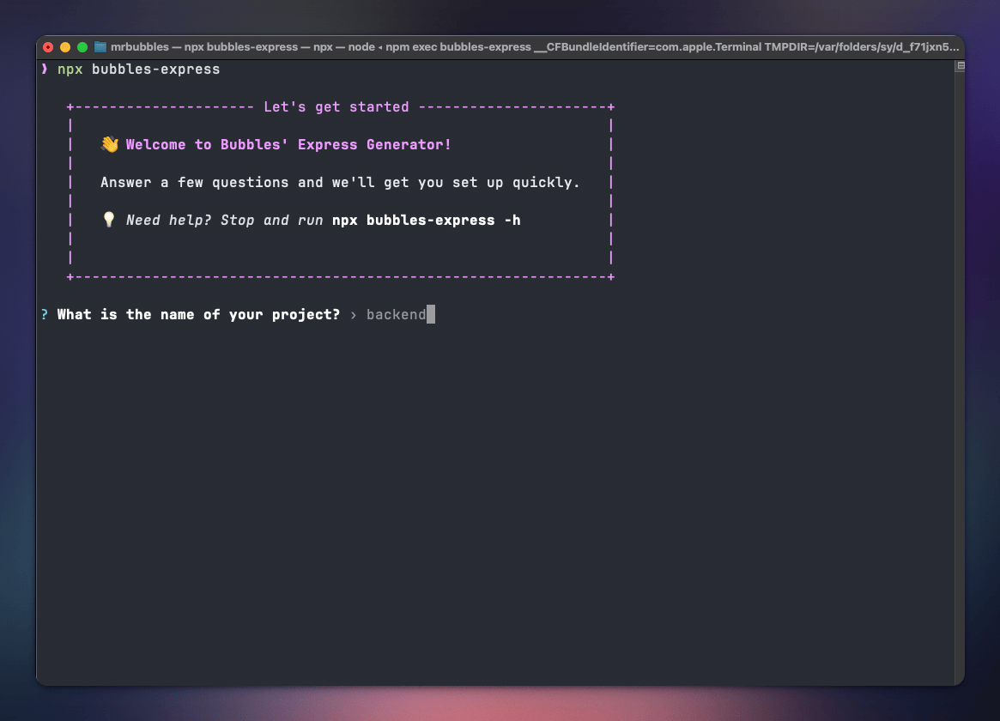

# bubbles-express-generator

A simple CLI to scaffold Express.js starter projects.



## 🔧 Usage

You can use the CLI via `npx` (no installation needed):

```bash
npx bubbles-express
```

Or if you prefer to, install it globally:

```bash
npm install -g bubbles-express-generator
```

Then you can run it with:

```bash
bubbles-express
```

## 🧪 Variants

The generator supports different project types:

- **(Supabase) PostgreSQL + Drizzle ORM + TypeScript**
- **MongoDB (Atlas) + Mongoose ODM + TypeScript**
- **(Supabase) PostgreSQL + Drizzle ORM + JavaScript**
- **MongoDB (Atlas) + Mongoose ODM + JavaScript**

## 📁 Output

A new folder will be created with the generated code based on your selections.  
If the current directory is not empty, you'll be prompted whether to overwrite it or choose a new name.  
After that, dependencies will be installed automatically.

Once it's done, you can start your project with:

```bash
cd your-project-name
npm run dev
```

You're ready to go!

## 🏁 Flags

You can skip the interactive prompts by providing flags directly:

- `--ts` or `--js`: Set the language (TypeScript or JavaScript)
- `--pg` or `--mongo`: Choose your database (PostgreSQL or MongoDB)

Example:

```bash
npx bubbles-express my-api --ts --pg
```

If all necessary flags are provided, the generator will auto-run without any questions.

## 📖 Help

To display the help menu, you can run:

```bash
npx bubbles-express --help
```

This will show a list of available flags and usage examples.

## 🤝 Contributions

This is my very first npm package — so it's likely to have more quirks than I realized 😅  
Feel free to open an issue for improvements or bug fixes, or submit a pull request directly.

## 🔗 Links

- 📄 [Documentation](https://github.com/mrbubbles-src/bubbles-express-generator)
- 🌐 [Website](https://github.com/mrbubbles-src/bubbles-express-generator)
